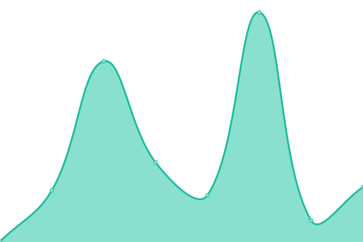
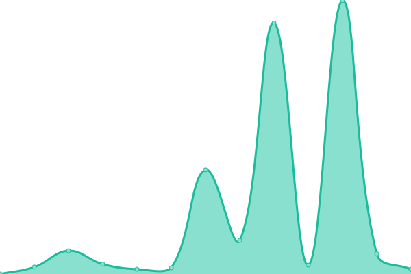

# [📈 Live Status](https://greatnessinabox.github.io/site-monitors): <!--live status--> **🟩 All systems operational**

This repository contains the open-source uptime monitor and status page for [Marquis Nobles](https://marquis.codes), powered by [Upptime](https://github.com/upptime/upptime).

With [Upptime](https://upptime.js.org), you can get your own unlimited and free uptime monitor and status page, powered entirely by a GitHub repository. We use [Issues](https://github.com/greatnessinabox/site-monitors/issues) as incident reports, [Actions](https://github.com/greatnessinabox/site-monitors/actions) as uptime monitors, and [Pages](https://greatnessinabox.github.io/site-monitors) for the status page.

<!--start: status pages-->
<!-- This summary is generated by Upptime (https://github.com/upptime/upptime) -->
<!-- Do not edit this manually, your changes will be overwritten -->
<!-- prettier-ignore -->
| URL | Status | History | Response Time | Uptime |
| --- | ------ | ------- | ------------- | ------ |
|  [TED](https://www.ted.com) | 🟩 Up | [ted.yml](https://github.com/greatnessinabox/site-monitors/commits/HEAD/history/ted.yml) | 

 148ms
     
 | 

<a href="https://greatnessinabox.github.io/site-monitors/history/ted">100.00%</a>
    

|  [Robert Morris](https://pastorrobert.com) | 🟩 Up | [robert-morris.yml](https://github.com/greatnessinabox/site-monitors/commits/HEAD/history/robert-morris.yml) | 

 146ms
     
 | 

<a href="https://greatnessinabox.github.io/site-monitors/history/robert-morris">100.00%</a>
    

|  [Such Great Heights](https://suchgreatheights.com) | 🟩 Up | [such-great-heights.yml](https://github.com/greatnessinabox/site-monitors/commits/HEAD/history/such-great-heights.yml) | 

 185ms
     
 | 

<a href="https://greatnessinabox.github.io/site-monitors/history/such-great-heights">100.00%</a>
    

|  [India Earl Education](https://indiaearleducation.com) | 🟩 Up | [india-earl-education.yml](https://github.com/greatnessinabox/site-monitors/commits/HEAD/history/india-earl-education.yml) | 

 401ms
     
 | 

<a href="https://greatnessinabox.github.io/site-monitors/history/india-earl-education">100.00%</a>
    

|  [Malibu Juice Club](https://malibujuiceclub.com) | 🟩 Up | [malibu-juice-club.yml](https://github.com/greatnessinabox/site-monitors/commits/HEAD/history/malibu-juice-club.yml) | 

 929ms
     
 | 

<a href="https://greatnessinabox.github.io/site-monitors/history/malibu-juice-club">100.00%</a>
    

|  [Marquis Codes](https://marquis.codes) | 🟩 Up | [marquis-codes.yml](https://github.com/greatnessinabox/site-monitors/commits/HEAD/history/marquis-codes.yml) | 

 288ms
     
 | 

<a href="https://greatnessinabox.github.io/site-monitors/history/marquis-codes">100.00%</a>
    

|  [Kebrado](https://kebrado.com) | 🟩 Up | [kebrado.yml](https://github.com/greatnessinabox/site-monitors/commits/HEAD/history/kebrado.yml) | 

 2188ms
     
 | 

<a href="https://greatnessinabox.github.io/site-monitors/history/kebrado">100.00%</a>
    

|  [Unanimous Media](https://unanimousmedia.com) | 🟩 Up | [unanimous-media.yml](https://github.com/greatnessinabox/site-monitors/commits/HEAD/history/unanimous-media.yml) | 

 250ms
     
 | 

<a href="https://greatnessinabox.github.io/site-monitors/history/unanimous-media">96.28%</a>
    

<!--end: status pages-->

[**Visit our status website →**](https://greatnessinabox.github.io/site-monitors)

## 📄 License

- Powered by: [Upptime](https://github.com/upptime/upptime)
- Code: [MIT](./LICENSE) © [Marquis Nobles](https://marquis.codes)
- Data in the `./history` directory: [Open Database License](https://opendatacommons.org/licenses/odbl/1-0/)
